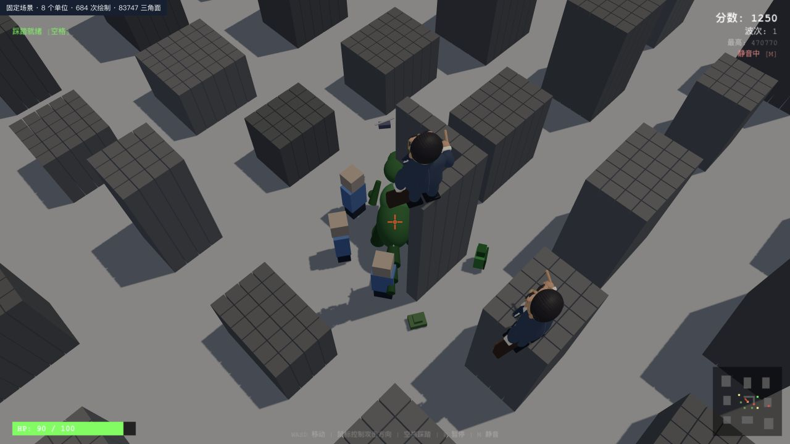
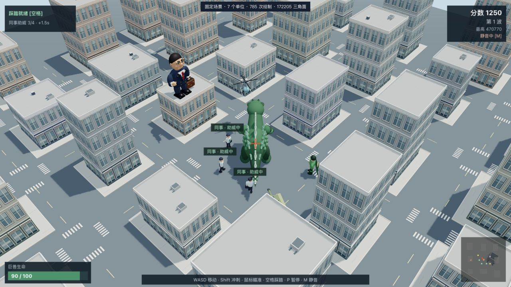
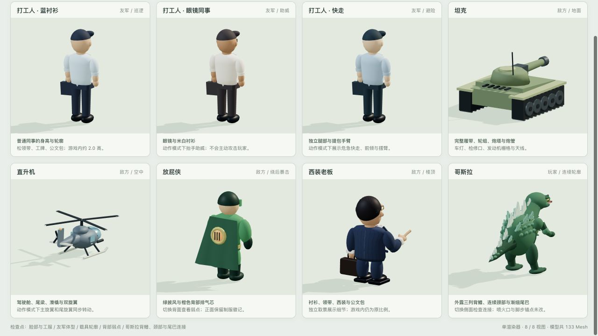
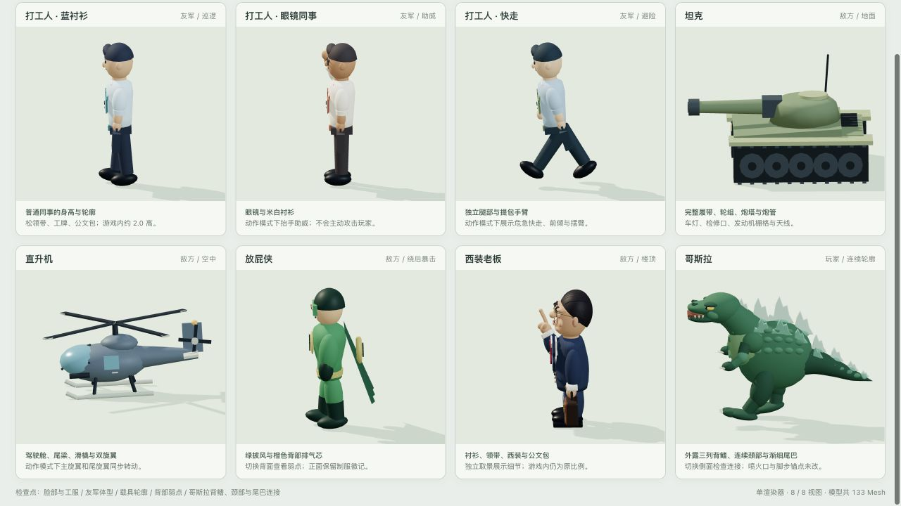
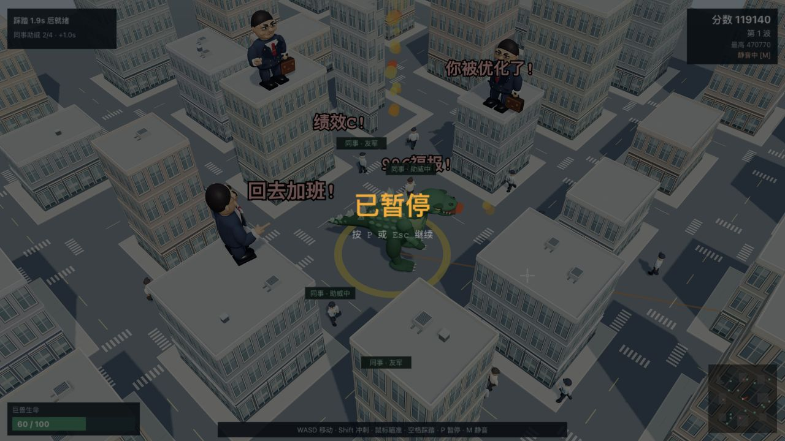
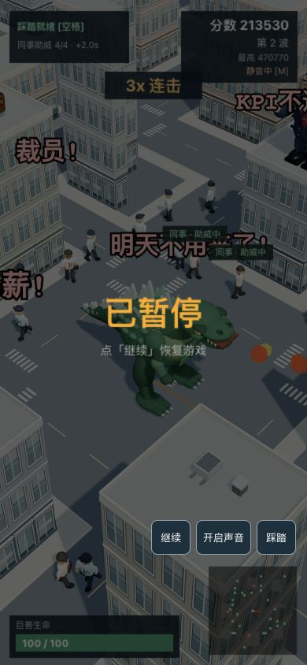
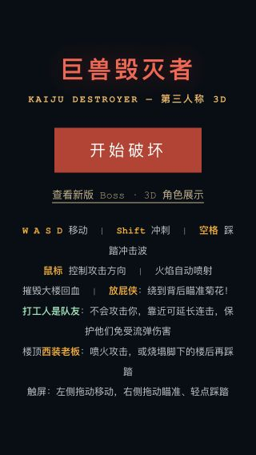
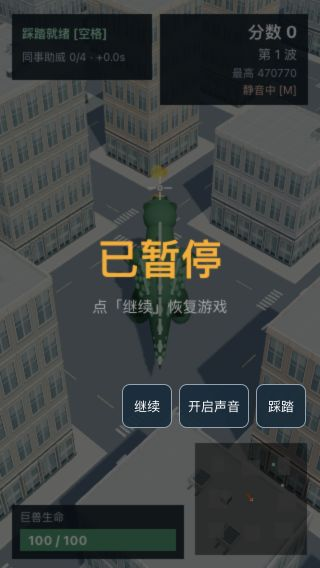

# 巨兽毁灭者：检查与修复记录

日期：2026-09-18。当前可试玩入口：<http://127.0.0.1:4399/kaiju-destroyer.html>。

这轮已直接修改游戏代码、模型和文档。核对基线是项目内 `README.md`、`plan.md`，没有收到另一份独立设计文件。保留程序化、卡通 3D、离线本地资源的项目形式。

## 检查顺序与结果

1. **开始页和规则说明**：检查原始截图及文档，纠正“直接踩楼顶老板”的误导；明确打工人是友军，以及烧塌楼后再踩老板的顺序。补焦点样式与状态播报。
2. **开局、城市和角色**：保存固定种子场景作为改前证据，重做城市、普通单位和哥斯拉后再次截图；检查友军比例、连续墙面、街道标线、朝向和友军标签。
3. **战斗与状态**：用真实游戏代码回归火焰、建筑、踩踏、流弹、助威、连击、难度、掉落和固定时间步长；实际浏览器操作开局、瞄准、踩踏、暂停及恢复。
4. **角色细节和动作**：使用直接加载真实游戏模块的检查页，查看全部角色正面、背面、侧面，确认助威/行走、旋翼、披风和老板训话动作，以及哥斯拉颈尾连接与外露背鳍。
5. **窄屏与生命周期**：检查 390 × 844 的暂停按钮、320 × 568 的开始页与 HUD；Node 集成检查结束/重开、按钮显示、静音偏好与输入重置。

## 已修复的问题

| 类别 | 原问题及影响 | 当前处理 |
| --- | --- | --- |
| 打工人形象 | 三个大方块拼成高约 4.56 的单位，与“普通打工人”定位不符，缺少动作 | 改为约 2.0 高的衬衫、领带、工牌、公文包形象，提供三套工服配色、眼镜变体与独立四肢 |
| 打工人行为 | 巡逻位置和朝向不一致，助威缺少清晰反馈；生存得分让助威的连击价值被掩盖 | 独立巡逻朝向、平滑转身、避墙、行走和抬手；8 格内无遮挡助威，上限 4 人；HUD 持续显示人数和加成 |
| 城市建模 | 独立灰色柱体、楼体有缝、无立面层次，难以读成城市 | 连续楼体、窗框、基座、入口、檐口、外缘女儿墙、屋顶设备、人行道与道路标线；保留逐格摧毁 |
| 其他模型 | 坦克、直升机、英雄轮廓粗糙；哥斯拉颈尾断开、背鳍埋在身体里 | 补齐载具结构、英雄披风和背面弱点；哥斯拉连续颈尾、鳞甲、眼睛、三列背鳍与爪 |
| 火焰方向/射程 | 无限直线判定导致背后、射程外目标受伤；敌人生成顺序影响命中 | 限制前方 24 格，按前进采样顺序处理，增加精确末端边界回归 |
| 建筑受伤 | 每 0.15 格采样都可能重复扣同一栋楼血量，单次伤害严重放大 | 每轮每格仅结算一次，使用目标真实距离计算高度，完整前楼挡住后方 |
| 士气减益 | 建筑伤害未同步体现老板减益 | 建筑与敌人统一应用火焰 -40% |
| 连击 | 每秒生存分增加并续连击，挂机也能叠满 10 倍 | 生存分独立 +10，战斗连击由有效破坏/击杀触发 |
| 老板弹幕 | 生命周期只够飞 5 格；硬编码伤害绕过波次成长；宽屋顶会吞掉自身弹幕 | 生命周期覆盖射击距离，使用成长后的伤害；先越过同高发射屋顶再俯冲，其他高楼仍挡弹 |
| 踩踏 | 能打中空中直升机；可见冲击圈远大于真实半径 | 排除飞行单位，冲击圈最大半径与伤害统一为 4 格 |
| 流弹 | 同一颗弹先打玩家后又杀同事，或先判人再判挡路的楼 | 先判遮挡，命中一个目标后立即结束；误伤高度与工人新体型一致 |
| 移动 | 斜走更快，按点碰撞会穿入墙体 | 归一化方向，按躯干半径碰撞、沿墙滑动，出生留出活动空间 |
| 时间推进 | 144 Hz 等屏幕让游戏更快；重绘会推进倒塌/粒子 | 固定 60 Hz 模拟，长停顿限制补帧，渲染不推进生命周期 |
| 输入 | 长按暂停反复开关，触摸取消误踩踏，暂停/重开残留移动 | 忽略开关键重复，取消触摸仅释放输入；开始/暂停/失焦清理键盘和触摸状态 |
| 界面 | 浅色城市吞掉 HUD 白字，助威只在已有连击时可见，触屏无暂停入口 | 深色信息底板、持续助威人数、文字友军标签、窄屏操作按钮与响应式说明 |

## 画面对照

下图均为本轮本地浏览器实拍。改前/改后使用相同固定种子；出生区域、镜头角度和模型尺寸按修复后的实现更新，不是像素级差分。

改前：

改后：

角色近景，直接使用游戏模型：

实际游戏暂停与窄屏：

## 验证证据

- 40 组 Node 回归全部通过：玩法/UI 生命周期 23、Boss 5、城市 6、单位 5、哥斯拉 1。完整输出见 [validation.txt](validation.txt)。
- 游戏、Boss 展示页和两个视觉检查页内联脚本通过语法检查；四个模型模块及预览服务通过语法检查。
- 城市回归包含 900 格模型及 64 次随机地图重开；共享几何缓存保持在固定上界内。角色材质独立，销毁一个单位不影响同类单位。
- `serve.cjs` 已验证主页、模型资源、检查页、404 和 HEAD，仅绑定本机回环地址。
- 新开的真实游戏标签页覆盖开局、瞄准、踩踏、暂停恢复和窄屏按钮，控制台记录中没有 error；有本地 Three.js r160 的弃用提示。见 [browser-console.json](browser-console.json)。早期 iframe 检查页出现过无源地址的 MutationObserver 错误，未在真实游戏新标签页复现，因此未将其断言为游戏逻辑错误。

## 仍需区分的边界

- 本轮没有获得独立设计原稿，不能宣称已与未知文件逐项一致。
- 手机部分为浏览器窄屏验证，并非手机真机触控、发热或帧率验收；file 协议未重新跑浏览器验收。
- 敌人仍用局部绕行，复杂街角可能走弯路；建筑仍采用逐格 Mesh，尚未做大规模实例化。40 组回归不代表所有运行条件下都没有问题。
- 文字标签、焦点样式与开始/暂停/结束状态播报有所改善，但实时 3D 场景仍依赖视觉操作，未声称通过完整无障碍合规审查。
- 未改变“摧毁回血、自动喷火”的整体难度设计；如需要重新设计难度曲线，应单独进行长时间试玩评估。

本轮修改前已在本机保留临时回退副本，该副本不随仓库分发，不替代长期版本管理。
